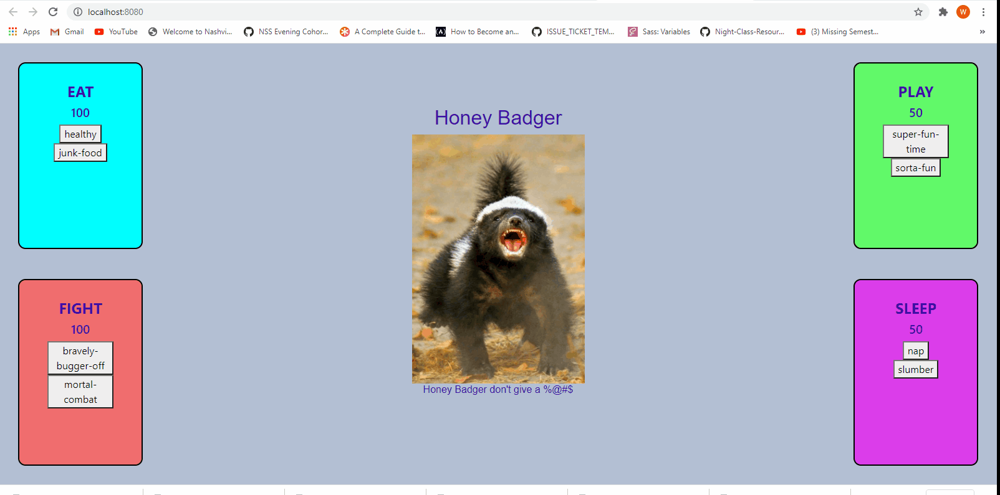

## Tamagotchi
The following project consists of an app that allows a user to experience the classic Tamagotchi Pet electronic toy. The user can manipulate various actions - sleep, play, fight, and eat - with the press of a button. Each button input affects the score for each respective 'quadrant' that displays an action. Some actions have more positive outcomes than others. 

## Motivation
The project was completed as part of an assignment for Nashville Software school. The project incorporates new skills learned at the time, including Webpack and SASS. This also provided continued practice in modularizing code. I plan to modify the project with more complex elements, including an overall progress bar, improved styling, and interactive variables (e.g. overeating affects sleep).

## Demo

## Technologies Used
-HTML
-CSS
-JavaScript
-jQuery 
-GitHub
-VS Code
-Webpack
-SASS

## Contributors
[Wanda McInturff](https://github.com/wmmcinturff)